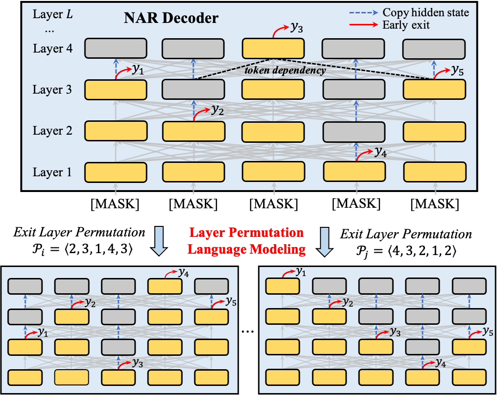

# ELMER
This repository contains code and checkpoints for **ELMER**:

[**ELMER: A Non-Autoregressive Pre-trained Language Model for Efficient and Effective Text Generation**](https://arxiv.org/abs/2210.13304)

Junyi Li, Tianyi Tang, Wayne Xin Zhao, Jian-Yun Nie, Ji-Rong Wen

## Introduction

To explicitly learn the bi-directional token dependency, we propose ELMER: an Efficient and Effective PLM for NAR text generation, which generates tokens at different layers by leveraging the early exit technique.

<div align=center></div>

The architecture of ELMER is a variant of the standard Transformer encoder-decoder and poses three technical contributions:

1. For decoder, we replace the original masked multi-head attention with bi-directional multi-head attention akin to the encoder. Therefore, ELMER dynamically adjusts the output length by emitting an end token `[EOS]` at any position.
2. Leveraging early exit, ELMER injects "off-ramps" at each decoder layer, which make predictions with intermediate hidden states. If ELMER exits at the l-th layer, we copy the l-th hidden states to the subsequent layers.
3. ELMER utilizes a novel pre-training objective, layer permutation language modeling (LPLM), to pre-train on the large-scale corpus. LPLM permutes
the exit layer for each token from 1 to the maximum layer.

## Pre-trained Models

We provide the checkpoint for ELMER-base, which was pre-trained on 16GB English corpus, Wikipedia and BookCorpus.

- [ELMER-base](): 6 layers encoder, 6 layers decoder, 12 attention heads, and 768 hidden dimensions.

The checkpoint can be directly used with Hugging Face Transformers. In the future, we will integrate ELMER into [Hugging Face]() and [TextBox]() libraries.

## Requirements

To install requirements

```shell
bash install.sh
```

## How to use

The pre-training code can be found [here](pre-train), and the fine-tuning code can be found [here](fine-tune).

To pre-train or fine-tune ELMER, please copy the file `modeling_bart.py` from the `pre-train` or `fine-tune` directory to the `BART` directory in Transformers, such as `~/miniconda3/envs/[env_name]/lib/python3.7/site-packages/transformers/models/bart`.

```python
from transformers import BartTokenizer as ElmerTokenizer
from transformers import BartForConditionalGeneration as ElmerForConditionalGeneration

tokenizer = ElmerTokenizer.from_pretrained("elmer-base")
model = ElmerForConditionalGeneration.from_pretrained("elmer-base")

#--------------------------------
# do training for many many steps
#--------------------------------
```

## Contact

If you have any problems, raise an issue or contact <lijunyi@ruc.edu.cn>.

## Citation

```bibtex
@article{lijunyi2022elmer,
  title={ELMER: A Non-Autoregressive Pre-trained Language Model for Efficient and Effective Text Generation},
  author={Li, Junyi and Tang, Tianyi and Zhao, Wayne Xin and Nie, Jian-Yun and Wen, Ji-Rong},
  booktitle={EMNLP 2022},
  year={2022}
}
```
